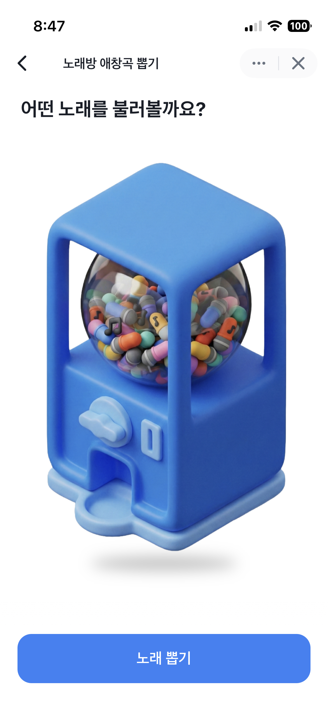
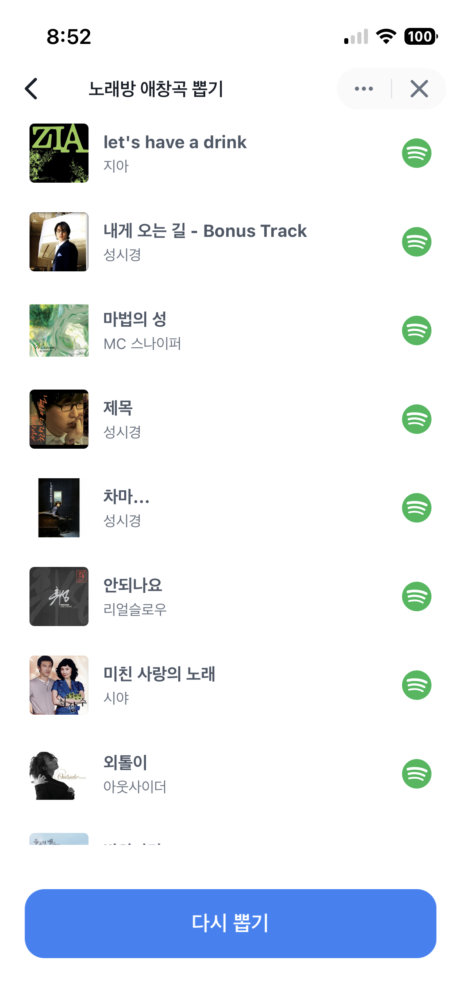

# 🎤 노래방 애창곡 뽑기 (Karaoke Gacha)

> 토스 미니앱(Apps in Toss) 기반 랜덤 노래 추천 서비스

## 개요

코인노래방에서 "뭐 부르지?" 고민을 해결해주는 가챠 스타일 노래 추천 앱입니다.

<p align="center">
  
  <span>  </span>
  
</p>

## 기술 스택

| 분류          | 기술                                        |
| ------------- | ------------------------------------------- |
| Framework     | Next.js 16 (App Router), React 19, TypeScript 5 |
| Mini App      | Apps in Toss (Granite CLI)                  |
| Design System | @toss/tds-mobile                            |
| Server State  | TanStack Query 5                            |
| Styling       | Tailwind CSS 4                              |
| Validation    | Zod 4                                       |
| Backend       | Supabase (PostgreSQL, RPC)                  |

## 아키텍처

**Clean Architecture + Feature-Sliced Design** 적용

> 테스트 용이성과 인프라 교체 유연성을 위해 레이어 분리

```
src/
├── app/              # Pages (Next.js App Router)
├── domain/           # 순수 도메인 모델
├── features/         # 기능 모듈 (hooks, ui, usecase, ports, actions)
├── infrastructure/   # 외부 시스템 연동 (Supabase, DI)
├── view/             # 복합 UI 위젯
└── shared/           # 공용 유틸리티
```

## 주요 기능

**아키텍처**

- Clean Architecture 레이어 분리 (Domain → UseCase → Repository)
- Port/Adapter 패턴으로 인프라 교체 용이
- Zod 스키마로 API 응답 검증 + DTO → Domain 매핑
- 환경 변수도 Zod로 앱 시작 시 검증

**최적화**

- Prefetch로 UX 최적화 (뽑기 애니메이션 중 데이터 로딩)
- Supabase RPC로 DB 레벨 랜덤 처리 (전체 조회 없이 요청한 곡 수만 반환)

**기능**

- 10곡 랜덤 추천 & 다시 뽑기
- 가챠 머신 UI + 애니메이션 (float, shake, marquee)
- 뽑는 동안 햅틱 진동 (Apps in Toss `generateHapticFeedback`)
- 곡별 Spotify 링크 연결
- 곡 데이터는 Spotify 플레이리스트에서 시드 스크립트로 수집
